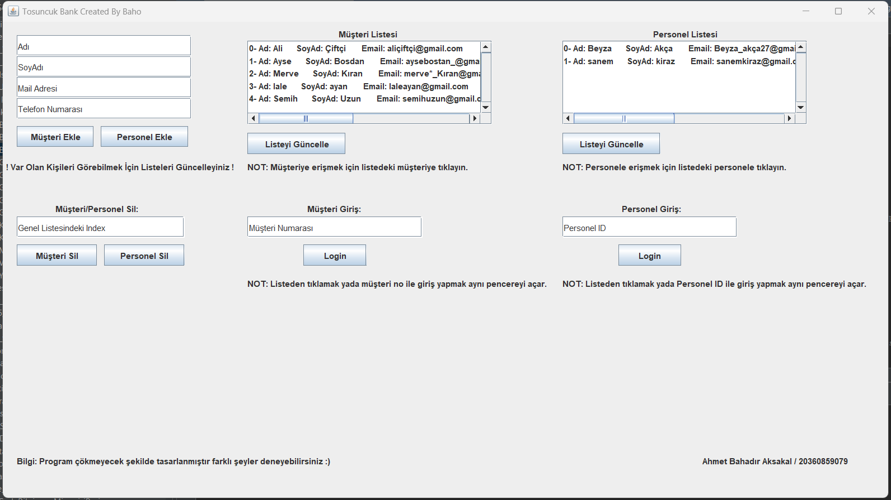
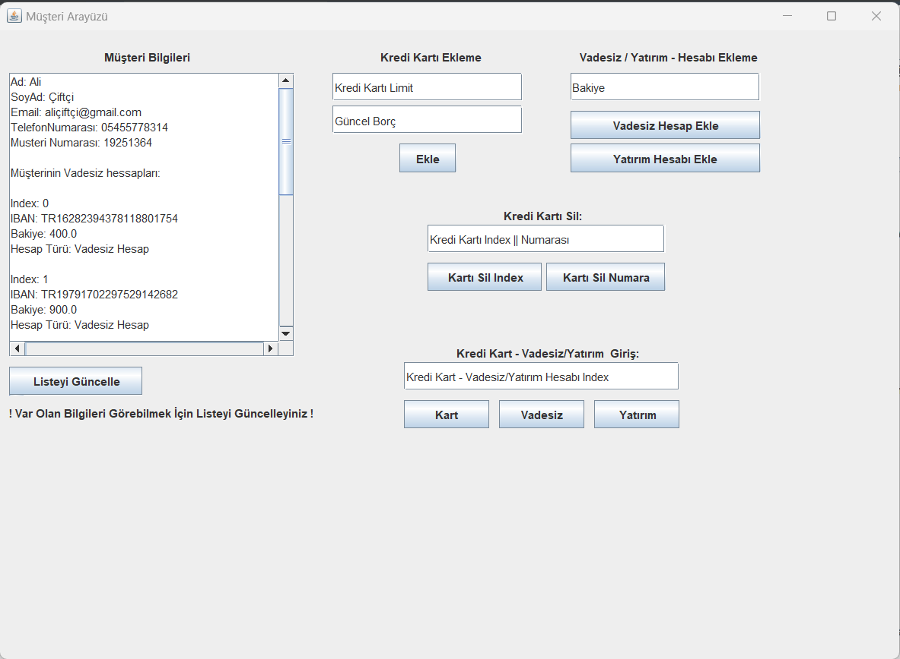
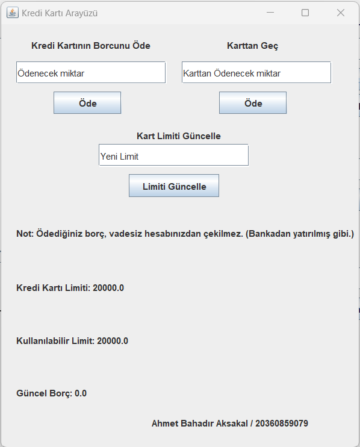
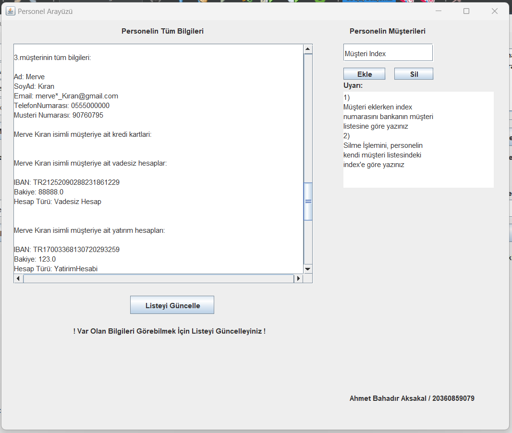

# Bankacılık Uygulaması 

<h3 align="center" color="Darkblue">Ahmet Bahadır Aksakal</h3>
<h4 align="center" color="Darkblue">20360859079</h4>
<h5 align="center" color="Darkblue">Bursa Teknik Üniversitesi - 1. Sınıf 2.Dönem - Nesneye Yönelik Programlama Dersi Proje Ödevi</h5>

<ol>
  <li>
      <h3 color="Red">Program Ne Yapar</h3>
      <ul>
        <li>Bu programda bir banka arayüzü simüle edilmiştir.</li>
        <li>Banka bünyesinde çalışan personeller eklenebilir.</li>
        <li>Bankanın müşterileri sisteme eklenebilir.</li>
        <li>Müşteriler için birden fazla vadesiz hesap, vadeli hesap veya yatırım hesabı açılabilir.</li>
        <li>vadeli hesap,vadesiz hesap, ve yatırım hesaplarını kullanmak için gerekli arayüzler farklılık göstermektedir.</li>
        <li>Müşterilere ait hesaplarla para yatırma, para çekme, kredi çekme, taksit kapatma gibi işlemler yapılabilir.</li>        
        <li>Yapılan bu işlemler anlık olarak sisteme yansır.</li>
        <li>Her müşteri bir adet personele atanır, ve bu personel o müşterinin ilgili bilgilerine sistem üzerinden ulaşabilir.</li>
        <li>Personel arayüzünden, ilgili müşteriye ait bilgiler yeniden düzenelenbilir.</li>
      </ul>
  </li>
  <li>
      <h3 color="Red">Projede Kullanılan Teknoloji Ve Diller:</h3>
      <ul>
        <li>Java</li>
        <li>Java - Swing</li>
      </ul>
  </li>
  <li>
      <h3 color="Red">Nasıl Kullanılır</h3>
      <ul>
        <li>Program derlenmiş java dosyası üzerinden çalıştırılır.</li>
        <li>Program arayüzündeki açıklamalar takip edilir.</li>
      </ul>
  </li>  
  <li>
      <h3 color="Red">Programdan Görseller:</h3>
      <ul>        
        <li></li> 
        <li></li>
        <li></li>
        <li></li>
        <li></li>
      </ul>
  </li>
</ol>

 
